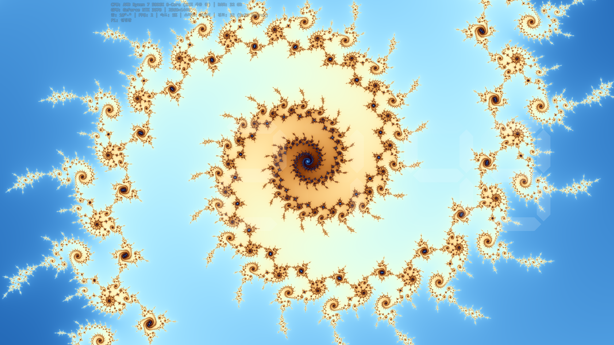
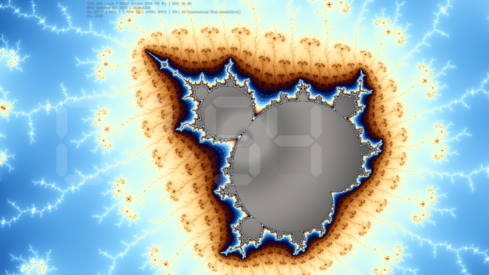
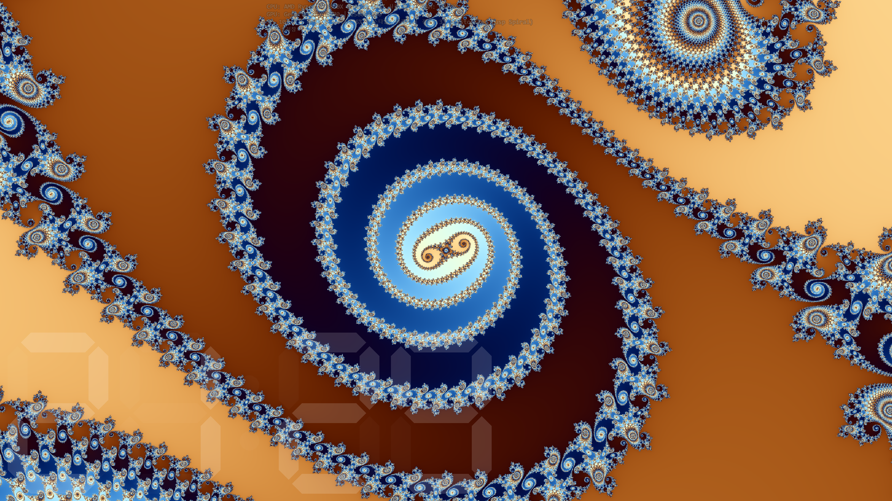
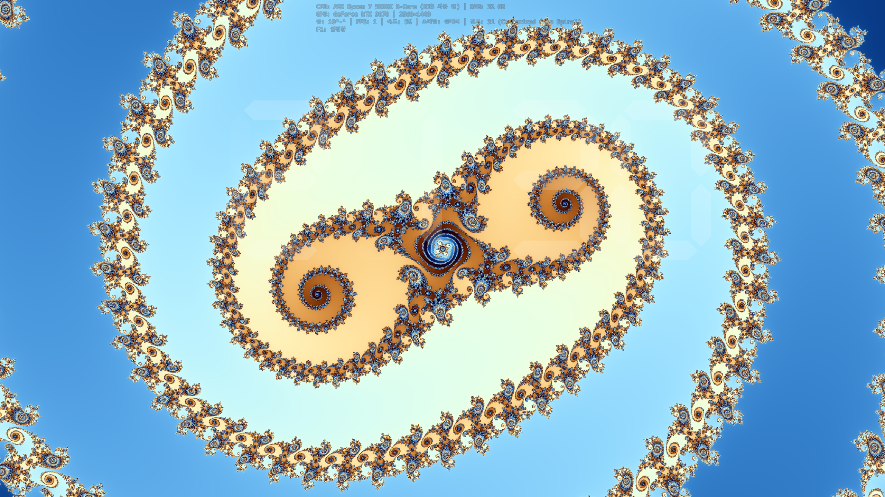
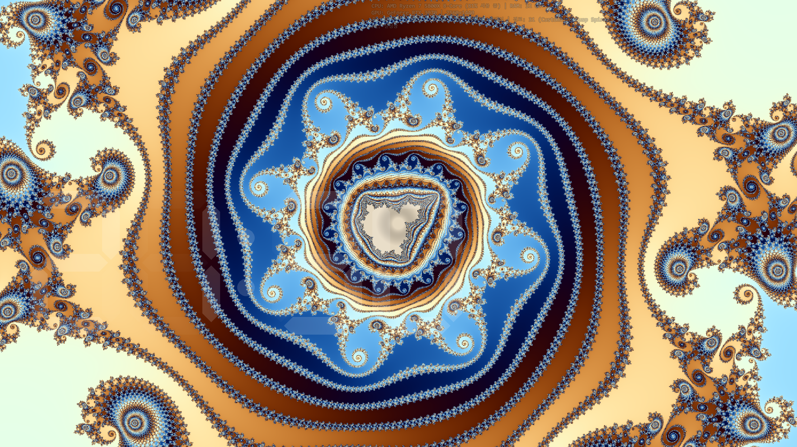

# FractalSaver — Windows용 실시간 만델브로 줌 스크린세이버

🌐 [English](README.md)

> 쉬고 있는 화면을 만델브로 집합의 무한한 여행으로 바꿔보세요.

---

## 갤러리

| | |
|:---:|:---:|
|  |  |
|  |  |
|  |  |

---

## FractalSaver란?

FractalSaver는 만델브로 집합을 실시간으로 렌더링하는 무료 Windows 스크린세이버입니다. 39개의 엄선된 줌 경로를 자동으로 탐색하며, 해마 계곡, 나선 은하, 미니 만델브로 복사본, 심층 바늘 구조 등 다양한 프랙탈 풍경 속으로 끊임없이 줌인합니다.

매번 실행할 때마다 새로운 경험을 제공합니다. 방문 순서는 셔플되고, 색상 테마와 컬러링 스타일이 랜덤하게 조합됩니다. 같은 애니메이션은 두 번 다시 나타나지 않습니다.

---

## 주요 기능

### CPU 렌더링 엔진
- **AVX2 SIMD** (4-lane double), 멀티스레드 4행 배치 분배
- **Brent 주기 검출**: 미니 벌브 내부 픽셀 조기 탈출
- **LUT 최적화 컬러링**: cos/log/exp 룩업 테이블로 빠른 픽셀당 컬러 계산
- **렌더 시간 기반 감속**: 프레임이 오래 걸리면 줌이 자동 감속되어 부드러운 보간 유지

### 아름다운 비주얼
- **6가지 색상 테마**: Red, Green, Blue, Cyan, Magenta, Gold — 매 실행마다 랜덤 셔플
- **5가지 컬러링 스타일**: Smooth Gradient, Contour Bands, Stripe Average, Triangle Inequality Average (TIA), Classic
- **30가지 시각적 조합**: 6 테마 x 5 스타일, 모두 셔플되어 최대한의 다양성 제공
- **자동 컬러 순환**: 매 프레임마다 색상이 회전하여 끝없이 변화하는 팔레트
- **2x2 슈퍼샘플링 안티앨리어싱**: 모든 줌 레벨에서 부드러운 경계

### 지능형 줌 애니메이션
- **39개 검증 경로** — 렌더 성능과 시각적 품질을 모두 검증한 경로
- **웨이포인트 경로**: 줌 도중 특정 배율에서 목표 좌표가 자동 변경되어 엄선된 경로를 따라감
- **부드러운 전환**: 경로 간 페이드 인/아웃 1.1초로 우아한 전환

### 다중 모니터 지원
- **자동 기본 모니터 선택**: 가장 큰 모니터에서 렌더링, 나머지 모니터는 종횡비 보존 중앙 크롭으로 미러링
- **보조 모니터**: 경량 미러 창 (입력 처리, 커서 숨김, grace period 2초)
- **에뮬레이션 모드**: `/emu` (듀얼) 또는 `/emu:N` (N=2~4)으로 단일 모니터에서 다중 모니터 테스트

### 오버레이 & 시계
- **시스템 정보 오버레이**: CPU 모델, RAM, 해상도, FPS, 줌 배율, 반복 횟수
- **7-세그먼트 디지털 시계**: 바운스 물리 + LED 스타일 반투명 렌더링

### 통합 인스톨러
- **단일 바이너리**: 인스톨러 + 스크린세이버 통합 — 확장자 기반 모드 감지 (.exe=설치, .scr=스크린세이버)
- **자동 업데이트 알림**: GitHub Releases에서 새 버전 확인, 설정 다이얼로그에 다운로드 링크 표시

### 가볍고 독립적
- **단일 파일** (~500 KB .exe) — 런타임 의존성, .NET, Java 불필요
- **정적 CRT** (/MT) — 깨끗한 Windows 설치 환경에서 바로 실행
- **설치 기능 내장** — 별도 인스톨러 없이 자동 UAC 권한 상승
- **외부 의존성 제로** — C++20으로 처음부터 직접 구현

---

## 시스템 요구사항

| 항목 | 최소 사양 |
|------|-----------|
| OS | Windows 10 / 11 (64비트) |
| CPU | Intel Haswell (2013+) 또는 AMD Excavator (2015+), AVX2 지원 |
| RAM | 64 MB 여유 |
| 디스크 | 1 MB 미만 |

---

## 설치 방법

1. `FractalSaver.exe` [다운로드](#다운로드) (저사양 PC는 `FractalSaverLite.exe`)
2. 더블클릭으로 실행 — 런처 다이얼로그 표시
3. **"설치"** 클릭 — UAC 자동 상승 후 스크린세이버 설치
4. 화면 보호기 설정에서 **"Fractal"** 선택 후 **적용**

설치 없이 미리보기: 런처에서 **"미리보기"** 클릭, 또는 `FractalSaver.exe /s`

제거: 같은 .exe를 다시 실행해서 **"제거"** 클릭, 또는 `/u` 플래그로 실행

---

## 설정

| 항목 | 옵션 | 기본값 |
|------|------|--------|
| 줌 속도 | 1 (느림) ~ 10 (빠름) | 8 |
| 컬러 스타일 | 자동 순환 / Smooth / Contour / Stripe / TIA / Classic | 자동 순환 |
| 프랙탈 렌더링 | 켜기 / 끄기 | 켜기 |
| 정보 오버레이 | 켜기 / 끄기 | 켜기 |
| 디지털 시계 | 켜기 / 끄기 | 끄기 |

---

## 기술적 하이라이트

- **C++20**, MSVC Build Tools 2022
- **AVX2 intrinsics** (`__m256d`): 4픽셀 동시 계산
- **Brent 주기 검출**: 반복 32회 이후 내부 픽셀 조기 탈출
- **ColorPalette LUT**: cos (1024), log (4096), exp (512) 엔트리 룩업 테이블
- **Cardioid/Period-2 Bulb 조기 거절**: SIMD 가속, 대부분의 interior 점을 반복 없이 판정
- **One-pass 행 렌더링**: 스택 할당 버퍼 (~40 KB, L1 캐시 적합)
- **웨이포인트 줌 경로**: 특정 줌 배율에서 목표 좌표 자동 변경
- **렌더 시간 기반 줌 감속**: 어떤 렌더 속도에서도 부드러운 보간 유지
- **전체 프로그램 최적화** (/GL + /LTCG) 및 링크 타임 코드 생성

---

## 아름다움 뒤의 수학

FractalSaver는 모든 픽셀에 대해 만델브로 반복 **z = z² + c**를 계산하며, 다음과 같은 기법들로 시각적 품질을 높입니다:

- **스무스 반복 횟수**: `n + 1 - log₂(log₂(|z|))`로 컬러 밴딩 제거
- **코사인 팔레트**: Inigo Quilez 스타일, 채널별 위상 오프셋으로 자연스러운 색상 변화
- **궤도 트랩** (Stripe/TIA): 각도 및 방사형 궤도 통계 누적으로 풍부한 텍스처링
- **동적 최대 반복 횟수**: `200 + 120 * log₂(zoom)` + 깊은 줌 부스트, 100 단위 반올림

---

## 다운로드

| 에디션 | 설명 | 다운로드 |
|--------|------|----------|
| **Full** | 네이티브 해상도, 프레임 제한 없음 | [**FractalSaver.exe**](https://github.com/jogakdal/fractal-screensaver/releases/latest/download/FractalSaver_v1.3.0.exe) |
| **Lite** | 절반 해상도, 30 fps 제한 — 저사양 PC용 | [**FractalSaverLite.exe**](https://github.com/jogakdal/fractal-screensaver/releases/latest/download/FractalSaverLite_v1.3.0.exe) |

- [전체 릴리스](https://github.com/jogakdal/fractal-screensaver/releases)
- [WinCustomize](https://www.wincustomize.com/explore/screensavers/1693/)

---

## 개발자 후원

FractalSaver가 마음에 드셨다면, 개발을 후원해 주세요:

---

## 제작자

**황용호** ([@jogakdal](https://github.com/jogakdal))

- **이메일**: jogakdal@gmail.com / jogakdal@naver.com
- **블로그 (Velog)**: https://velog.io/@jogakdal
- **블로그 (Naver)**: https://blog.naver.com/jogakdal

---

## 라이선스

All rights reserved. This software is provided as-is for personal use.

---

*FractalSaver — 수학과 예술이 만나는 곳.*
