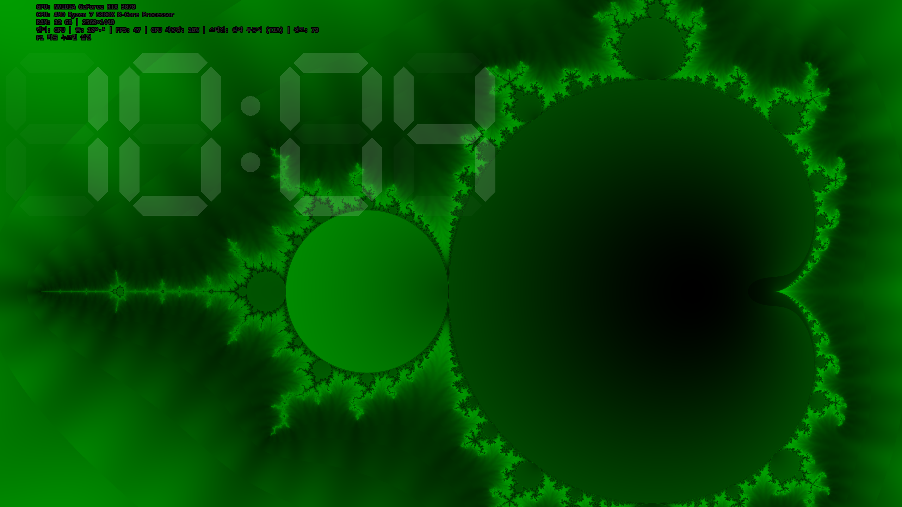
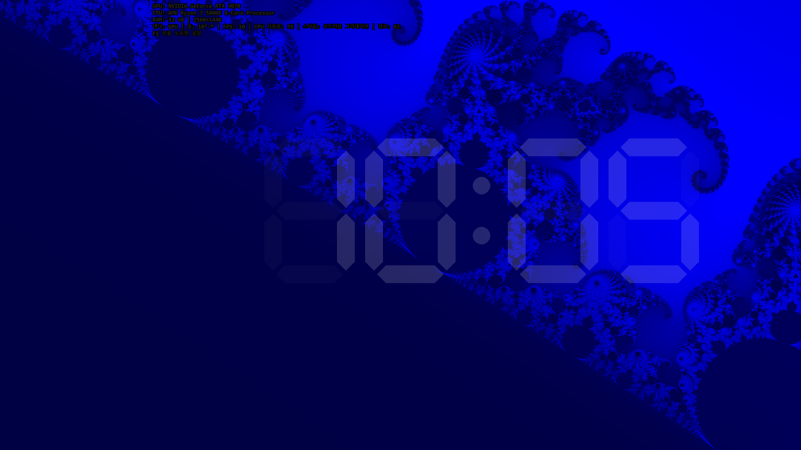
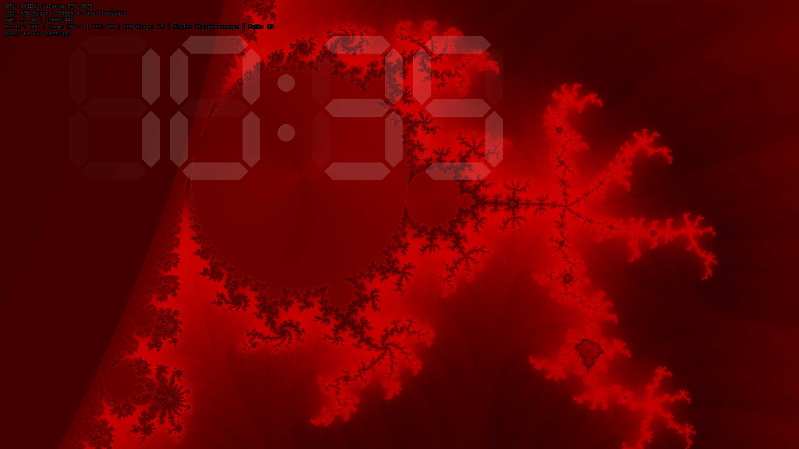
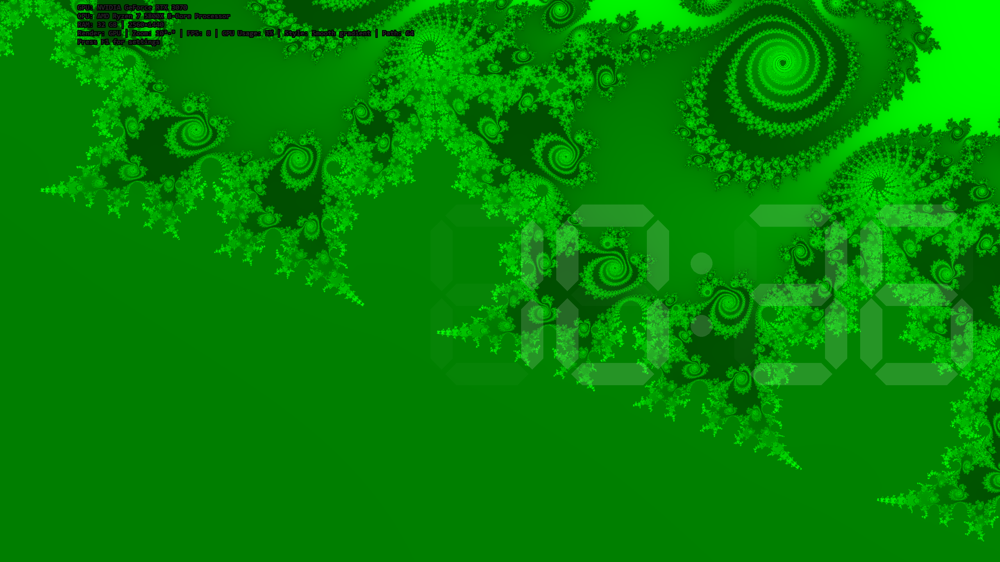
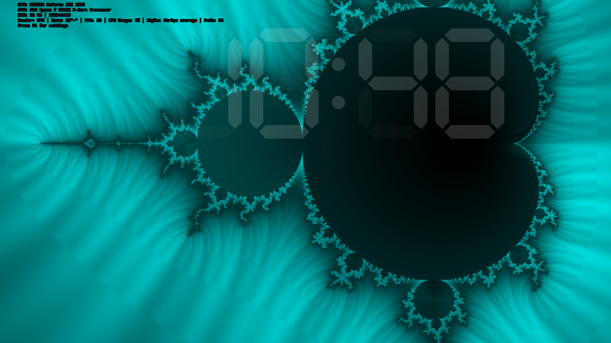
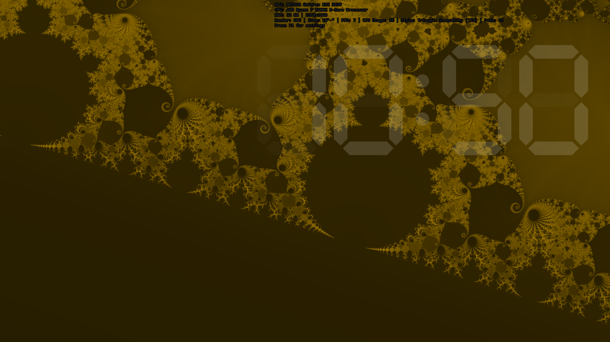
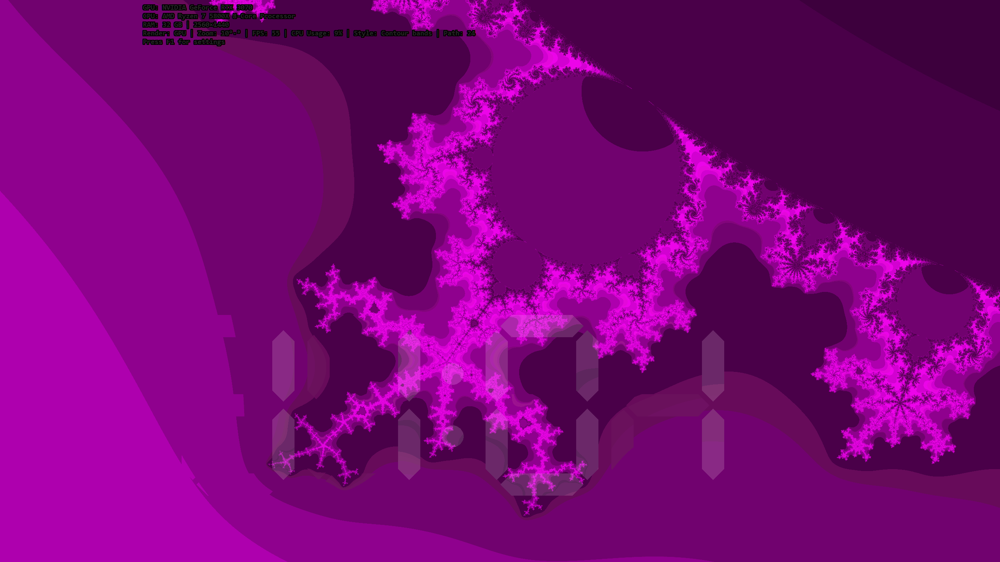

# FractalSaver — Windows용 실시간 만델브로 줌 스크린세이버

🌐 [English](README.md)

> 쉬고 있는 화면을 만델브로 집합의 무한한 여행으로 바꿔보세요.

---

## 갤러리

| | |
|:---:|:---:|
|  |  |
|  |  |
|  |  |

---

## FractalSaver란?

FractalSaver는 만델브로 집합을 실시간으로 렌더링하는 무료 Windows 스크린세이버입니다. 15개 카테고리에 걸친 100개의 엄선된 좌표를 자동으로 탐색하며, 해마 계곡, 나선 은하, 미시우레비치 점, 미니 만델브로 복사본 등 다양한 프랙탈 풍경 속으로 끊임없이 줌인합니다.

매번 실행할 때마다 새로운 경험을 제공합니다. 방문 순서는 셔플되고, 줌 타겟은 랜덤하게 오프셋되며, 색상은 연속적으로 변화합니다. 같은 애니메이션은 두 번 다시 나타나지 않습니다.

---

## 주요 기능

### 이중 렌더링 엔진
- **GPU 모드**: D3D11 Compute Shader + double-float 에뮬레이션 (~48비트 정밀도)
- **CPU 폴백**: AVX2 SIMD (4-lane double), 멀티스레드 — 전용 GPU 없이도 동작

### 아름다운 비주얼
- **6가지 색상 테마**: Red, Green, Blue, Cyan, Magenta, Gold — 매 실행마다 랜덤 셔플
- **4가지 컬러링 스타일**: Smooth Gradient, Contour Bands, Stripe Average, Triangle Inequality Average (TIA)
- **24가지 시각적 조합**: 6 테마 x 4 스타일, 모두 셔플되어 최대한의 다양성 제공
- **자동 컬러 순환**: 매 프레임마다 색상이 회전하여 끝없이 변화하는 팔레트
- **2x2 슈퍼샘플링 안티앨리어싱**: 모든 줌 레벨에서 부드러운 경계
- **최대 16,384배 줌**: double-float 정밀도로 프랙탈 심층 구조 탐색

### 지능형 줌 애니메이션
- **100개 탐색 좌표** (15개 카테고리) — 지루할 틈이 없습니다
- **경계 추적**: 카메라가 시각적으로 가장 복잡한 경계를 자동으로 따라감
- **적응형 방향 전환**: 줌 도중 근처의 정교한 패턴을 탐색하며 방향을 바꿈
- **곡률 필터링**: 단조로운 직선 경계는 자동으로 건너뜀

### 오버레이 & 시계
- **시스템 정보 오버레이**: GPU/CPU 모델, RAM, 해상도, FPS, 줌 배율, 반복 횟수 표시
- **7-세그먼트 디지털 시계**: 바운스 물리 + LED 스타일 반투명 렌더링

### 가볍고 독립적
- **단일 파일** (~446 KB .exe) — 런타임 의존성, .NET, Java 불필요
- **정적 CRT** (/MT) — 깨끗한 Windows 설치 환경에서 바로 실행
- **설치 기능 내장** — 별도 인스톨러 없이 자동 UAC 권한 상승
- **외부 의존성 제로** — C++20으로 처음부터 직접 구현

---

## 시스템 요구사항

| 항목 | 최소 사양 |
|------|-----------|
| OS | Windows 10 / 11 (64비트) |
| CPU | Intel Haswell (2013+) 또는 AMD Excavator (2015+), AVX2 지원 |
| GPU | DirectX 11 지원 GPU (선택사항 — CPU 폴백 가능) |
| RAM | 64 MB 여유 |
| 디스크 | 1 MB 미만 |

---

## 설치 방법

1. [**FractalSaver.exe**](https://github.com/jogakdal/fractal-screensaver/releases/latest/download/FractalSaver.exe) 다운로드
2. 더블클릭으로 실행 — UAC 자동 상승 후 스크린세이버 설치
3. 화면 보호기 설정 대화상자가 자동으로 열림

설치 없이 미리보기: `FractalSaver.exe /s`

제거: `FractalSaver.exe /u` 또는 Windows 표준 제거 기능 사용

---

## 설정

| 항목 | 옵션 | 기본값 |
|------|------|--------|
| 렌더링 | GPU (자동) / CPU 강제 | GPU 자동 |
| 줌 속도 | 1 (느림) ~ 10 (빠름) | 3 |
| 컬러 스타일 | 자동 순환 / Smooth / Contour / Stripe / TIA | 자동 순환 |
| 정보 오버레이 | 켜기 / 끄기 | 켜기 |
| 디지털 시계 | 켜기 / 끄기 | 끄기 |

---

## 기술적 하이라이트

- **C++20**, MSVC Build Tools 2022
- **D3D11 Compute Shader** (cs_5_0): `precise` 키워드 + IEEE 엄격 모드로 수치 정확성 보장
- **AVX2 intrinsics** (`__m256d`): 4픽셀 동시 계산
- **GPU double-float 에뮬레이션**: Dekker 분할로 ~48비트 가수부 정밀도 달성
- **Cardioid/Period-2 Bulb 조기 거절**: SIMD 가속, 대부분의 interior 점을 반복 없이 판정
- **One-pass 행 렌더링**: 스택 할당 버퍼 (~40 KB, L1 캐시 적합) vs. 132 MB 힙
- **지수적 줌**: 적응형 패닝 + 경계 인식 타겟 추적
- **이진 탐색 경계 탐지**: 30~50회 반복, 정밀도 ~10^-9 ~ 10^-15
- **PCA 곡률 분석**: 시각적으로 흥미롭지 않은 경계 자동 필터링
- **전체 프로그램 최적화** (/GL + /LTCG) 및 링크 타임 코드 생성

---

## 아름다움 뒤의 수학

FractalSaver는 모든 픽셀에 대해 만델브로 반복 **z = z² + c**를 계산하며, 다음과 같은 기법들로 시각적 품질을 높입니다:

- **스무스 반복 횟수**: `n + 1 - log₂(log₂(|z|))`로 컬러 밴딩 제거
- **코사인 팔레트**: Inigo Quilez 스타일, 채널별 위상 오프셋으로 자연스러운 색상 변화
- **궤도 트랩** (Stripe/TIA): 각도 및 방사형 궤도 통계 누적으로 풍부한 텍스처링
- **Interior 컬러링**: 평균 궤도 크기로 pseudo-iteration 생성, 발산하지 않는 점에도 풍부한 패턴
- **동적 최대 반복 횟수**: `100 + 50 × log₂(zoom)`, 최대 5000

---

## 다운로드

| 에디션 | 설명 | 다운로드 |
|--------|------|----------|
| **Full** | 네이티브 해상도, 프레임 제한 없음 | [**FractalSaver.exe**](https://github.com/jogakdal/fractal-screensaver/releases/latest/download/FractalSaver.exe) |
| **Lite** | 절반 해상도, 30 fps 제한 — 저사양 PC용 | [**FractalSaverLite.exe**](https://github.com/jogakdal/fractal-screensaver/releases/latest/download/FractalSaverLite.exe) |

- [전체 릴리스](https://github.com/jogakdal/fractal-screensaver/releases)
- [WinCustomize](https://www.wincustomize.com/explore/screensavers/1693/)

---

## 개발자 후원

FractalSaver가 마음에 드셨다면, 개발을 후원해 주세요:

---

## 제작자

**황용호** ([@jogakdal](https://github.com/jogakdal))

- **블로그 (Velog)**: https://velog.io/@jogakdal
- **블로그 (Naver)**: https://blog.naver.com/jogakdal

---

## 라이선스

All rights reserved. This software is provided as-is for personal use.

---

*FractalSaver — 수학과 예술이 만나는 곳.*
